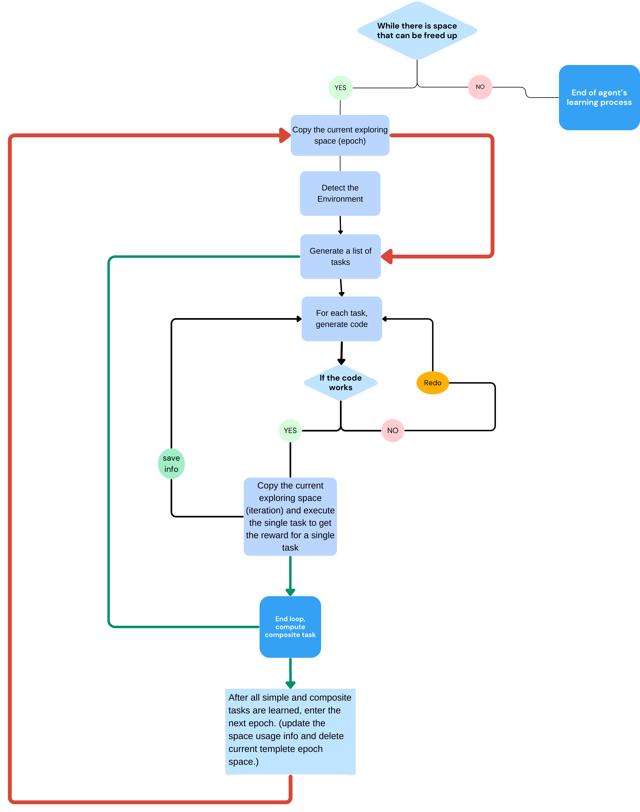
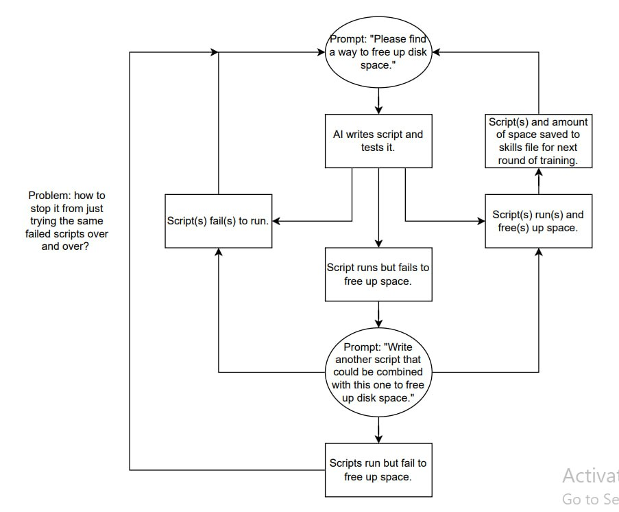

# Negative Space Learning

Code for Negative Space Learning.

## Entry Points

| Script                              | Scope          | Usage                                                     |
| ----------------------------------- | -------------- | --------------------------------------------------------- |
| `scripts/run_train_loop.py`         | Full loop      | Runs generation→training cycles. **Primary entry point.** |
| `scripts/generate_training_data.py` | One generation | Runs N episodes, collects SFT rows, checkpoints progress. |
| `scripts/run_episode.py`            | One episode    | Executes a single episode (v1 pipeline or v2 mode-based). |

```bash
# Full training loop (most common)
uv run python scripts/run_train_loop.py --config config/config-test-loop.toml

# Single generation (data collection only)
uv run python scripts/generate_training_data.py --config config/config-generation.toml

# Single episode (debugging / standalone)
uv run python scripts/run_episode.py config/config-container.toml
```

## Harness images (container harness only)

The container harness (used by ms-agent, AIQ, and any other Dockerised
harness profile under `docker/<harness>/`) needs a Docker image.
Provisioning is automatic and runs on every entry point before any worker
slots spawn.

**Drift detection is now automatic.** Every locally-built image is
stamped with an `nsl.build-context-sha` label containing a content hash
of its build context (see
`src/harness/provisioning.py` and
`docs/design/msagent-workflow-lifecycle-and-measurement.md`
§"Stale-image footgun mitigation"). On each run the provisioner
re-hashes the context; on mismatch it auto-rebuilds with `nocache=True`.
Images without the label (predating drift-detection) are also treated as
stale and rebuilt once.

| Situation                                                                 | What you do                                     | What happens                                                                                                                                                                                                                                |
| ------------------------------------------------------------------------- | ----------------------------------------------- | ------------------------------------------------------------------------------------------------------------------------------------------------------------------------------------------------------------------------------------------- |
| Fresh host, first run                                                     | Just run                                        | Image is built locally if config has `[harness.container.build]`; otherwise pulled.                                                                                                                                                         |
| Subsequent run, no source edits                                           | Just run                                        | Cached image reused. Startup log: `harness image X present locally (content hash matches build context)`.                                                                                                                                   |
| You edited `docker/<harness>/Dockerfile` or anything in its build context | Just run                                        | Provisioner detects context drift and auto-rebuilds with `nocache=True`. Startup log: `harness image X is stale: ...; rebuilding with nocache=True`.                                                                                        |
| You want to force a `nocache` rebuild anyway                              | Pass `--rebuild-harness`                        | Sets `build.force=True`; rebuilds even if the hash matches.                                                                                                                                                                                 |
| Edits aren't being picked up                                              | Config has no `[harness.container.build]` block | Image is pulled from a registry, not built — drift detection cannot run on a pull-only image. Add a build block (see `config/config-forked-exploit-msagent.toml`) or use a config that has one. `--rebuild-harness` will warn in this case. |
| Last-resort escape hatch                                                  | `docker rmi <image-tag>` then re-run            | Image is missing → provisioning rebuilds (if build block) or pulls.                                                                                                                                                                         |

Hidden files/dirs and `__pycache__` are excluded from the context hash
to avoid spurious rebuilds; everything else is included by design
(over-include is cheap, under-include is the silent-staleness bug we're
guarding against).

For the standalone build helper used during early bring-up:

```bash
uv run python scripts/build_harness_images.py             # builds whatever today's configs declare
uv run python scripts/build_harness_images.py --rebuild   # force --no-cache
```

This is a bridge utility (Approach A in the provisioning design doc);
since entry-point provisioning now covers both first-build and drift,
this script is rarely needed and will be retired once every config has
a `[harness.container.build]` block.

## Inference Backends

Open-weights inference can run through either `vllm:` or `sglang:` model
prefixes.

## Defining a task

Refer to [`tasks/memory_cleanup.py`](tasks/memory_cleanup.py) as an example of how to define a task.

We are intentionally aiming for a split similar to PyTorch Lightning: task-specific logic goes on the task object, while infrastructure selection stays in the framework/runtime layer. `TaskSpec` plays the role of a `LightningModule`-like unit for episode logic, and the harness layer (`src/harness/`, including the orchestrator-modes harness and the ms-agent / AIQ profiles), Docker execution, and the parallel workers play the role of the trainer/strategy side of the system. The same `TaskSpec` runs unchanged against any harness — the harness picks its own vocabulary (modes, ReAct, tool-calling, function specs) for the `Capability` set declared by the task.

The overall signature (see [`src/task/base.py`](src/task/base.py)):

```
TaskSpec (abstract, generic over StateT)
    │
    │  — Environment lifecycle —
    ├── list_variations()         → variations for episode diversity (abstract)
    ├── reset(containers)         → return containers to neutral state (default: no-op)
    ├── populate(...)             → apply a variation → PopulationOutcome (abstract)
    ├── verify_population(...)    → check post-populate state (default: True)
    │
    │  — Prompts, workflow, constraints —
    ├── prompt_spec(...)          → TaskPromptSpec: system prompt + capabilities (abstract)
    ├── workflow(...)             → optional harness-neutral Workflow of steps
    ├── episode_constraints(...)  → budgets / success rules / per-step overrides
    │
    │  — Agent loop hooks (called per turn by the harness) —
    ├── parse_response(...)       → extract CapabilityInvocations from raw text
    ├── execute_capability(...)   → run task-side work for an invocation → CapabilityResult
    │
    │  — Measurement & reward —
    ├── measure_initial_state(...)→ StateT before the agent runs (abstract)
    ├── measure_final_state(...)  → StateT after the agent runs (default: same as initial)
    ├── compute_reward(...)       → pure: (initial, final, artifacts) → TaskReward (abstract)
    └── finalize_episode(...)     → template: measure_final → compute_reward
```

Per-episode the framework guarantees the order: `reset` → `populate` → `verify_population` → `prompt_spec` → `measure_initial_state` → [harness-driven agent loop calling `parse_response` / `execute_capability` per turn] → `finalize_episode`.

A single `TaskSpec` instance is shared across parallel episode workers, so implementations must be stateless w.r.t. episodes — never store episode-scoped data on `self`. Subclasses must accept a single `task_config: dict[str, Any]` constructor argument and define the class-level identity attributes (`name`, `description`, `metric_name`, `metric_unit`, `higher_is_better`, `docker_compose_dir`, `agent_service_name`).

## Project Flow



**Chain of thought prompting**


